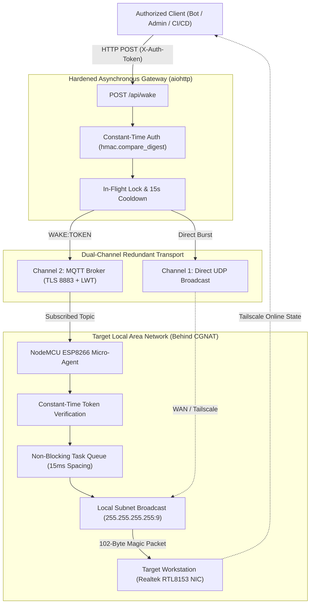

# Secure IoT Edge Wake-on-LAN (WoL) Micro-Agent & Gateway

> **Project Status:** `[FINISHED PROJECT]`  
> **Version:** 1.0.0 (Production Verified)  
> **Hardware Target:** ESP8266 NodeMCU V2 (ESP-12E) / Realtek RTL8153 Gigabit NIC  
> **Software Stack:** C++ (Arduino/PlatformIO), Python 3.12 (aiohttp, asyncio, paho-mqtt)  
> **License:** MIT  

---

## 📌 What Does It Do?

Remotely powering on workstations, home servers, and GPU compute nodes over the internet typically fails when the target machines are behind **Carrier-Grade NAT (CGNAT)**, dynamic IP connections, or strict ISP firewalls. Traditional solutions often rely on exposing unauthenticated UDP/HTTP ports to the public WAN or utilizing open, unencrypted MQTT topics—exposing internal home and lab networks to denial-of-service packet storms, unauthorized power manipulation, and network topology leaks.

This project delivers an **enterprise-grade, security-hardened Edge-to-Cloud Wake-on-LAN infrastructure**:
- An ultra-low-power **ESP8266 IoT Micro-Agent** sits inside the target local network, acting as an authenticated local broadcast injector.
- A hardened **Asynchronous Python Gateway** acts as the remote orchestration control point, providing authenticated REST APIs, automated deduplication, and non-blocking health monitoring.
- Enables seamless, instant, and secure workstation wake-up from any cloud server, Telegram bot, or CI/CD workflow without opening firewall ports to the PC or hardcoding Wi-Fi credentials into firmware.

---

## ⚡ Technical Summary

| Layer | Technology | Key Capabilities |
| :--- | :--- | :--- |
| **Edge Micro-Agent** | C++17, PlatformIO, ESP8266 | Dynamic Captive Portal (WiFiManager), Fail-Closed Token Verification, Non-Blocking Event Loop, Hardware Watchdog, MQTT Last Will and Testament (LWT). |
| **Orchestration Gateway** | Python 3.12, `aiohttp`, `asyncio` | Timing-Attack Resistant Auth (`hmac.compare_digest`), In-Flight Mutex Lock, 15-second Rate-Limit Cooldown, Atomic IP Auditing, Non-Blocking Socket Health Probes. |
| **Dispatch Pipeline** | Dual-Channel Redundancy | Simultaneous or fallback dispatch via Direct UDP Subnet Broadcast (`255.255.255.255:9`) and Authenticated MQTT Micro-Agent Bridge. |
| **Sandboxing & OS** | Linux Systemd Hardening | Production service unit with `ProtectSystem=strict`, `MemoryDenyWriteExecute=yes`, and zero capabilities. |

---

## 🔬 Technical Details & Engineering Architecture

### 1. Firmware Engineering (ESP8266 / NodeMCU)
- **Zero Plaintext Secrets:** No Wi-Fi SSIDs or passwords are baked into compiled binaries. If connection is lost or not yet configured, the device automatically spawns an encrypted WPA2 Access Point (`WoL-Bridge-Setup`) with a 180-second timeout, allowing on-demand web provisioning.
- **Fail-Closed Token Gate:** If `WAKE_AUTH_TOKEN` is unconfigured, set to default template, or contains insufficient entropy (< 16 characters), the micro-agent permanently disarms itself and rejects all incoming commands.
- **Strict Constant-Time Command Verification:** Eliminates timing attacks and loose substring vulnerabilities (e.g., legacy `indexOf("wake") >= 0`). Requires exact byte-for-byte matching of `WAKE:<TOKEN>` payloads using `constantTimeEquals()`.
- **Non-Blocking Execution (Preserving MQTT Keepalives):** `delay()` is strictly forbidden inside the MQTT callback. Magic packet dispatch and visual LED feedback are scheduled through an asynchronous `millis()` state machine in the main `loop()`, ensuring the broker keepalive ping is never stalled.
- **Last Will and Testament (LWT) Telemetry:** The micro-agent registers a retained `OFFLINE` LWT message on the broker. Upon clean connection, it publishes a retained `ONLINE` state, providing instantaneous visibility into device connectivity.
- **Watchdog & Self-Healing Backoff:** An 8-second hardware watchdog (`ESP.wdtEnable(8000)`) runs alongside a non-blocking `maintainWifiConnection()` loop with exponential backoff (2s → 60s), ensuring autonomous recovery from network drops without crashing into infinite reboot loops.
- **UDP Burst Buffer Protection:** Dispatches Magic Packets with 15ms calibrated intervals to prevent overflowing the ESP8266 physical network TX buffer.

### 2. Asynchronous Gateway Engineering (Python)
- **High-Throughput Asynchronous Core:** Built on `aiohttp.web`, removing thread-locking bottlenecks during external network I/O.
- **In-Flight Lock & Deduplication:** Concurrently arriving wake requests are synchronized using an `asyncio.Lock()`. If multiple cloud triggers fire within a 15-second window, duplicate network broadcasts are suppressed, and callers receive explicit status metadata (`{"ok": true, "dispatched": false, "cooldown_active": true}`).
- **Asynchronous Socket Health Check:** Replaces blocking `subprocess.run(["ping"])` calls with asynchronous socket connect probes to the target workstation's open port (e.g., SSH/Tailscale), backed by a 5-second TTL cache to prevent socket exhaustion.
- **Atomic & Validated IP Storage (`iprecord.py`):** Strictly validates incoming heartbeat IP addresses with Python's `ipaddress` library. Writes are performed via temporary file generation followed by atomic POSIX rename operations, preventing partial read corruption. Ignores untrusted `X-Forwarded-For` headers from non-loopback remotes.
- **Production Systemd Sandboxing:** The deployment service unit (`deploy/wol-gateway.service`) enforces modern Linux container-like isolation: `ProtectSystem=strict`, `ProtectHome=yes`, `NoNewPrivileges=yes`, `MemoryDenyWriteExecute=yes`, and restricted system call filters.

---

## 📊 Architecture & Dataflow Diagram



---

## 📈 Production Benchmarks & Verification

### 1. Firmware Footprint (NodeMCU v2 / ESP-12E)
Compiled with Xtensa GCC 10.3.0 in Release Mode:
- **RAM Usage:** `33,388 bytes / 81,920 bytes` (**40.8%**)
- **Flash ROM:** `326,811 bytes / 1,044,464 bytes` (**31.3%**)
- **Cold Boot Time:** `~1.2 seconds` to authenticated Wi-Fi association
- **WoL Burst Duration:** `~32 ms` (3 packets spaced at 15ms)

### 2. Automated Test Suite (Pytest)
Comprehensive integration test suite covering input validation, token matching, cooldown semantics, and IP spoofing defenses:
```text
tests/test_gateway.py::TestWakeDispatcher::test_build_magic_packet_valid_mac PASSED
tests/test_gateway.py::TestWakeDispatcher::test_build_magic_packet_invalid_mac PASSED
tests/test_gateway.py::TestWakeDispatcher::test_wake_cooldown_deduplication PASSED
tests/test_gateway.py::TestWakeDispatcher::test_resolve_target_ip_precedence PASSED
tests/test_gateway.py::TestIPRecord::test_rejects_garbage PASSED
tests/test_gateway.py::TestIPRecord::test_roundtrip_and_read_missing PASSED
tests/test_gateway.py::TestIPRecord::test_read_corrupt_record_returns_none PASSED
tests/test_gateway.py::TestIPRecord::test_resolve_client_ip_ignores_xff_from_public_ip PASSED
tests/test_gateway.py::TestIPRecord::test_resolve_client_ip_trusts_xff_behind_loopback PASSED
tests/test_gateway.py::TestConfigValidation::test_placeholder_mac_is_error PASSED
tests/test_gateway.py::TestConfigValidation::test_missing_token_is_error PASSED
tests/test_gateway.py::TestConfigValidation::test_public_broker_is_warned PASSED
tests/test_gateway.py::test_auth_and_endpoints PASSED

============================== 13 passed in 0.41s ==============================
```

---

## 🚀 Getting Started & Deployment

### Hardware Requirements
- **Microcontroller:** NodeMCU ESP8266 V2 (ESP-12E) or any ESP8266/ESP32 development board.
- **Power:** Standard 5V micro-USB power supply.
- **Target Machine:** Any PC/server with a WoL-enabled Ethernet NIC (e.g., Realtek RTL8153, Intel I219/I225).

### 1. Firmware Setup & Flashing
1. Clone the repository:
   ```bash
   git clone https://github.com/g210101021/esp8266-secure-wol-bridge.git
   cd esp8266-secure-wol-bridge
   ```
2. Create your private configuration:
   ```bash
   cp include/config.example.h include/secrets.h
   ```
3. Generate a 64-character high-entropy cryptographic token:
   ```bash
   python3 -c "import secrets; print(secrets.token_hex(32))"
   ```
4. Edit `include/secrets.h` and populate:
   - `TARGET_MAC`: Target workstation NIC MAC address (e.g., `{0x00, 0xE0, 0x4C, 0x5E, 0x27, 0x38}`)
   - `WAKE_AUTH_TOKEN`: The 64-character token generated in step 3.
   - `AP_PORTAL_PASS`: WPA2 password for provisioning portal (≥ 8 characters).
5. Compile and flash using PlatformIO:
   ```bash
   pio run -t upload
   ```
6. On initial power-up, connect to the `WoL-Bridge-Setup` Wi-Fi network from your phone and enter your local Wi-Fi credentials via the captive portal.

### 2. Gateway Deployment (Linux / Cloud VPS)
1. Install Python dependencies:
   ```bash
   cd gateway
   pip install -r requirements.txt
   ```
2. Configure `.env`:
   ```bash
   cp .env.example .env
   # Set WOL_AUTH_TOKEN identical to include/secrets.h
   # Set TARGET_MAC to match target workstation
   ```
3. Verify test suite:
   ```bash
   PYTHONPATH=. pytest tests/ -v
   ```
4. Deploy systemd unit:
   ```bash
   sudo cp deploy/wol-gateway.service /etc/systemd/system/
   sudo systemctl daemon-reload
   sudo systemctl enable --now wol-gateway.service
   ```

---

## 📄 License
This project is licensed under the [MIT License](LICENSE).
