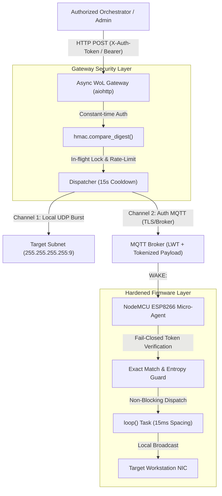

# Secure IoT Edge Wake-on-LAN (WoL) Micro-Agent & Gateway

An enterprise-grade, security-hardened IoT Edge bridge and asynchronous gateway designed to trigger Wake-on-LAN (WoL) Magic Packets for remote workstations and servers situated behind Carrier-Grade NAT (CGNAT) and strict firewalls.

---

## 🌟 Key Architecture & Threat Model Mitigations

Traditional remote wake implementations often rely on unauthenticated HTTP endpoints or open MQTT topics, exposing target networks to replay attacks, Denial-of-Service packet flooding, and network footprint leakage. 

This project solves these vulnerabilities through a defense-in-depth architecture:



---

## 🛡️ Security Features & Engineering Standards

### 1. Firmware (ESP8266 / NodeMCU)
- **Zero Plaintext Secrets:** No Wi-Fi passwords in source code. Utilizes **WiFiManager** captive portal (`WoL-Bridge-Setup`) for on-demand provisioning.
- **Fail-Closed Authentication:** If `WAKE_AUTH_TOKEN` is unset, weak (< 16 chars), or left as default template, the microcontroller permanently locks itself against all wake triggers.
- **Strict Constant-Time Token Matching:** Rejects loose substring matches (`indexOf("wake")`). Requires exact `WAKE:<TOKEN>` payloads verified via constant-time comparison to prevent timing attacks.
- **Non-Blocking Architecture:** Zero `delay()` calls inside the MQTT callback. Magic packet dispatch and LED animations are scheduled asynchronously in the main loop to preserve MQTT keep-alives and prevent broker disconnections.
- **Last Will and Testament (LWT):** Automatic broker announcement of `OFFLINE` status upon unexpected connection loss, and retained `ONLINE` telemetry upon reconnection.
- **Hardware Watchdog & Recovery:** Active 8-second hardware watchdog (`ESP.wdtEnable(8000)`) coupled with exponential backoff Wi-Fi reconnection logic (`maintainWifiConnection()`).

### 2. Asynchronous Gateway (Python)
- **High-Performance Asynchronous Stack:** Built with `aiohttp` and `asyncio`, eliminating single-threaded server blocking.
- **In-Flight Lock & Deduplication:** Prevents packet bursts and race conditions when multiple wake requests arrive concurrently.
- **Non-Blocking Health Check:** Port-level asynchronous socket probe with TTL caching (replaces blocking ping subprocesses).
- **Atomic & Validated IP Storage:** Validates client IPs and uses temporary file + atomic rename semantics (`iprecord.py`). Rejects untrusted `X-Forwarded-For` headers from public remotes.
- **Systemd Hardening:** Production service unit (`deploy/wol-gateway.service`) with strict sandboxing (`ProtectSystem=strict`, `MemoryDenyWriteExecute=yes`, empty capability sets).

---

## 📁 Repository Structure

```text
├── deploy/
│   └── wol-gateway.service       # Hardened systemd service unit
├── gateway/
│   ├── .env.example              # Environment configuration template
│   ├── config.py                 # Configuration loader and validator
│   ├── dispatcher.py             # Deduplicated multi-channel wake dispatcher
│   ├── iprecord.py               # Atomic and validated dynamic IP recording
│   ├── requirements.txt          # Python dependencies
│   └── wol_gateway.py            # Async HTTP gateway and REST API
├── include/
│   ├── config.example.h          # Microcontroller configuration template
│   └── secrets.h                 # (Gitignored) Hardware secrets & auth tokens
├── src/
│   └── main.cpp                  # Production-hardened C++ firmware
├── tests/
│   └── test_gateway.py           # Unit and integration test suite
├── platformio.ini                # PlatformIO build configuration
└── .gitignore                    # Comprehensive build & secret isolation
```

---

## 🚀 Getting Started

### Prerequisites
- [PlatformIO Core](https://platformio.org/)
- Python 3.10+
- ESP8266 NodeMCU V2 (or compatible ESP8266/ESP32 board)

### Step 1: Micro-Agent Configuration & Flashing
1. Copy the header template:
   ```bash
   cp include/config.example.h include/secrets.h
   ```
2. Generate a 32-byte cryptographic token:
   ```bash
   python3 -c "import secrets; print(secrets.token_hex(32))"
   ```
3. Set your target NIC MAC address and generated token in `include/secrets.h`.
4. Compile and upload firmware:
   ```bash
   pio run -t upload
   ```
5. On initial boot, connect to the `WoL-Bridge-Setup` Wi-Fi Access Point from your smartphone or laptop and configure your local Wi-Fi credentials.

### Step 2: Gateway Configuration & Deployment
1. Set up Python environment:
   ```bash
   cd gateway
   python3 -m venv venv
   source venv/bin/activate
   pip install -r requirements.txt
   ```
2. Create and configure `.env`:
   ```bash
   cp .env.example .env
   # Configure WOL_AUTH_TOKEN with the exact token generated in Step 1
   ```
3. Run tests to verify setup:
   ```bash
   PYTHONPATH=. pytest tests/ -v
   ```
4. Start gateway:
   ```bash
   python3 -m gateway.wol_gateway
   ```

---

## 🧪 Testing & Validation

The test suite covers full mock integration, token validation, rate-limiting, and packet structure:

```bash
PYTHONPATH=. pytest tests/ -v
# ============================== 13 passed in 0.41s ==============================
```

---

## 📜 License
MIT License. Created for secure, distributed computing and edge infrastructure orchestration.
